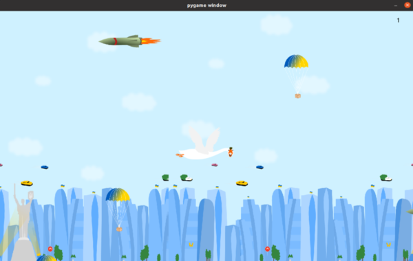

## Project BanderoGus

This is a project about the information of the fighting goose and the game.

Run it locally this project in your IDE.

1. Clone the repository:

 `git clone https://github.com/VitaliiKalyta96/BanderoGus`

2. Run file main.py:

 `main.py`

Access to website about banderogus which published and located on netlify.

📂 [File on netlify](https://wondrous-cascaron-70dd73.netlify.app/ ) Link on netlify.

or you can open the file `index.html` .